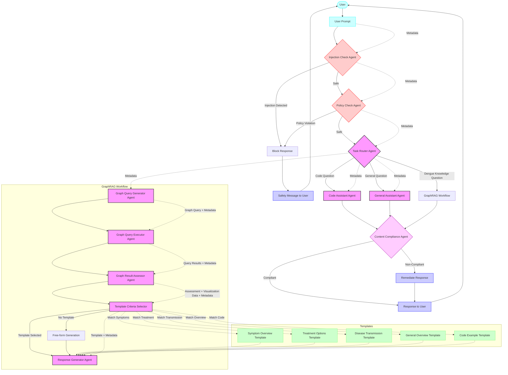
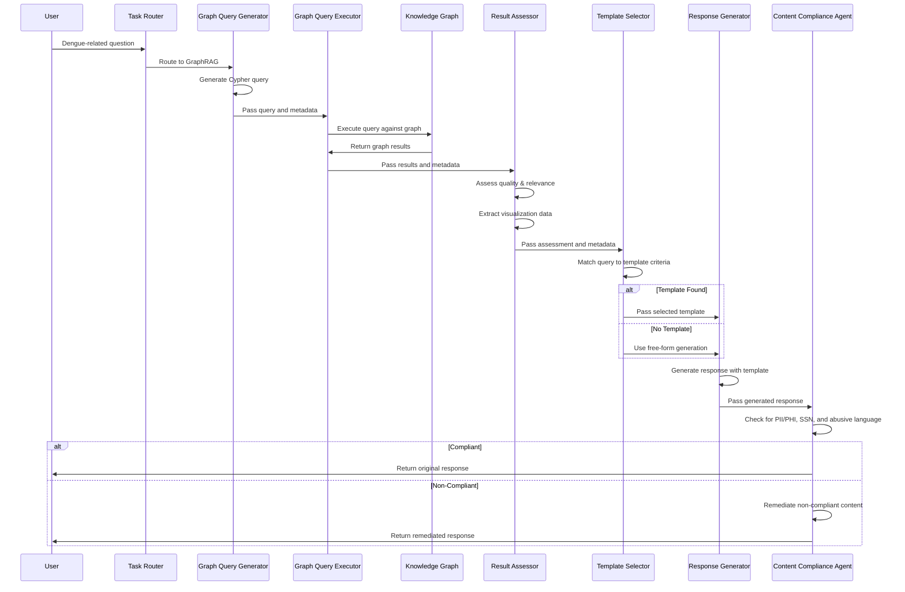
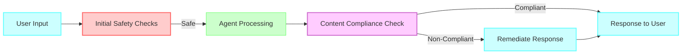
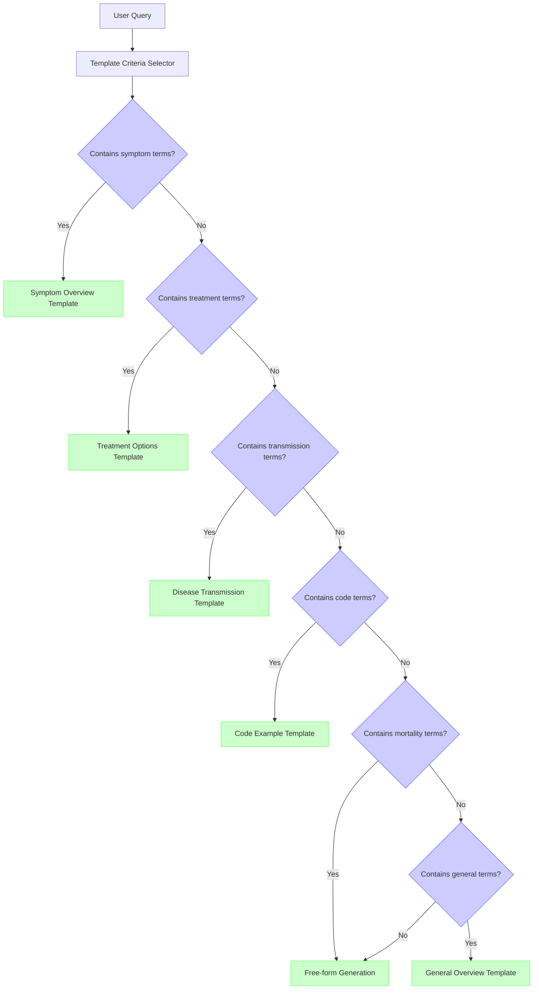
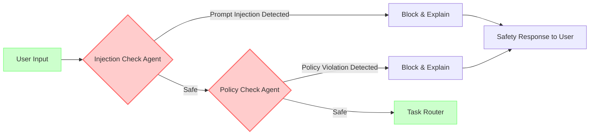

# Agent System Workflow Diagram

This document provides a comprehensive visualization of the entire agent system workflow, from initial user input to final response.

## Complete Agent Workflow

## GraphRAG Workflow with Compliance Check

## Compliance Sandwich Pattern

## Template Selection Criteria

## Safety Agent Workflow

